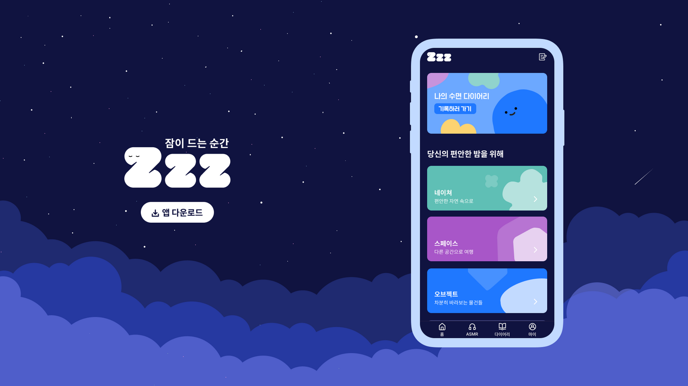

# README

잠이드는 시간 ZzzZ

<figure><figcaption></figcaption></figure>

> 매년 불면증으로 고생하는 사람들이 증가하고 있고, 특히 코로나로 인해 더욱 더 심리적인 긴장과 불안으로 많은 사람들이 수면 장애를 겪고 있습니다. 저희는 이런 어려움을 겪는 사람들을 위해 안정을 줄 수 있는 **ASMR을 제공**하고그날의 **수면 기록**을 남길 수 있는 서비스입니다.

#### [🔗 Zzz 사이트 보러 가기](https://zzzapp.co.kr/)

#### [🎥 시연영상 보러가기](https://www.youtube.com/watch?v=D4G0D7asSYU\&feature=emb\_logo)

#### [💤 Team Notion](https://www.notion.so/4-Zzz-329e8b67d7084050b688608e59c715de)

### 🧑🏼‍💻 개발기간

#### 2021.12.19 \~ 2021.1.28 (6주)

\

### 팀원 소개

프로젝트를 함께 진행한 팀원들입니다

| 포지션 | 팀원     | README                                                           |
| --- | ------ | ---------------------------------------------------------------- |
| FE  | 최수인 🔰 | [https://github.com/whl5105](https://github.com/whl5105)         |
| FE  | 김태언    | [https://github.com/Taeeon-kim](https://github.com/Taeeon-kim)   |
| FE  | 오은희    | [https://github.com/eundol0519](https://github.com/eundol0519)   |
| BE  | 김다희    | [https://github.com/huitopia](https://github.com/huitopia)       |
| BE  | 방민수    | [https://github.com/skylermbang](https://github.com/skylermbang) |

\

### 핵심기능

* **PWA push notifications**
  * 유저가 원하는 시간에 맞춰 백그라운드 푸쉬알림 서비스
* **ASMR 음원 커스텀**
  * 최대 4개의 음원 디테일 볼륨조절가능
  * 믹스 음원 저장가능
  * 모든 페이지에서 음원 스트리밍 가능
* **수면 다이어리**
  * 유저의 수면 패턴을 다이어리에 기록
  * 저번주와 이번주 수면 평균 통계 확인

\

### 🔨 기술 스택

`Front-end`

* React ,Redux, Styled-components, Firebase Cloud Messaging(FCM) , PWA, AWS S3, Cloud Front , Sentry

`Back-end`

* [Back-end 개발 Page](https://github.com/ZzzProject0/zzzGit)

`Tool`

* Git , GitHub

### UX Flow

### 아키텍처

\

### 📝 후기 및 팀 노션 페이지 Link

`최수인` https://puzzled-empress-d3f.notion.site/Zzz-4ac70594e110402393db7c80400251e9

`김태언` https://innovative-sunshine-4ce.notion.site/Zzz-76d1b5d54cd3442c88f05b80456705cb

`오은희` https://chrome-armadillo-b80.notion.site/f85caa16cc1d4d2bbe6a186b99b32d53

`팀 노션 페이지` [Zzz](https://www.notion.so/4-Zzz-329e8b67d7084050b688608e59c715de)
